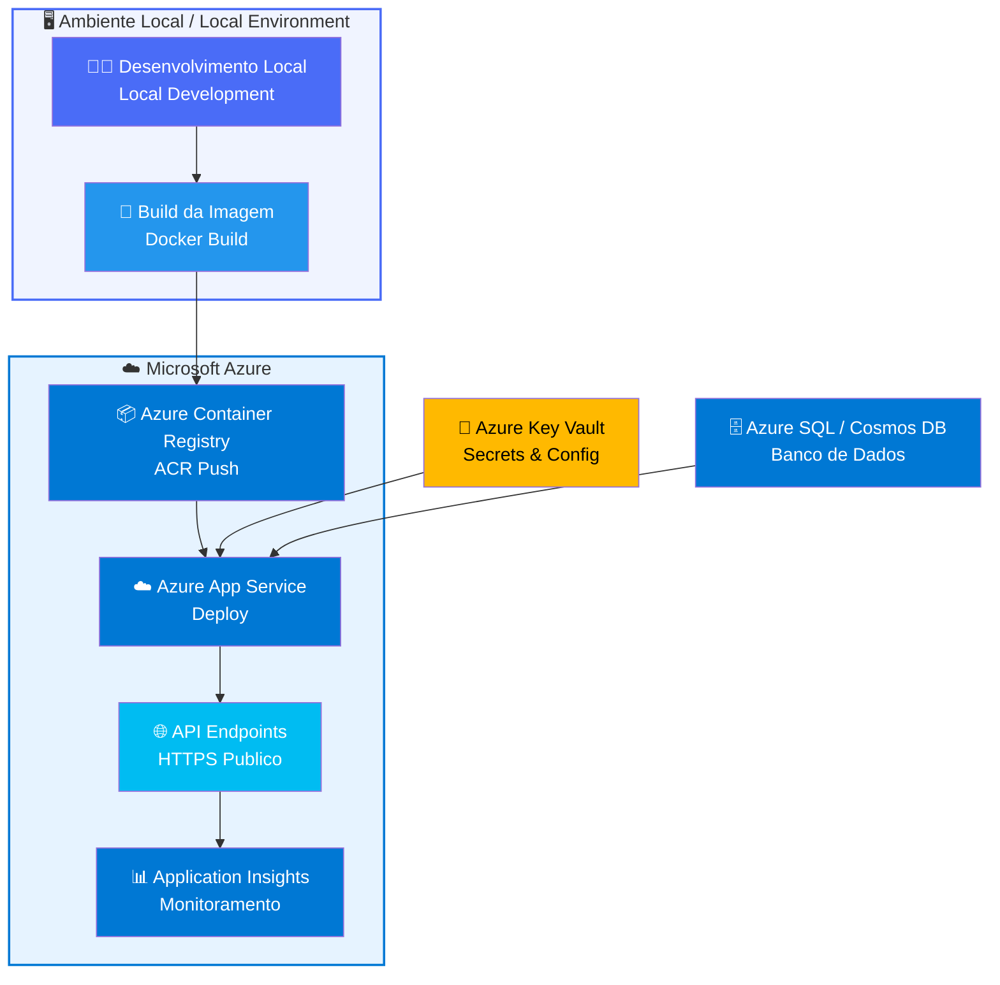

# azure-cloud-api-deploy

<div align="center">


**Deploy completo de uma API REST na nuvem Microsoft Azure**

*DIO Challenge — Certificação AZ-204: Developing Solutions for Microsoft Azure*

[PT-BR](#visao-geral) | [English](#overview)

</div>

---

## Visao Geral

Este projeto demonstra o ciclo completo de implantacao de uma API REST na nuvem Azure, desenvolvido como parte do desafio pratico da DIO para a certificacao **AZ-204 (Developing Solutions for Microsoft Azure)**. O foco esta na criacao, containerizacao e deploy de uma API funcional utilizando os principais servicos de computacao em nuvem da Microsoft.

O projeto cobre desde o desenvolvimento local ate a publicacao em producao no **Azure App Service**, incluindo configuracao de variaveis de ambiente, monitoramento com **Application Insights** e gerenciamento de recursos com **Azure CLI**.

---

## Overview

This project demonstrates the complete deployment cycle of a REST API on Microsoft Azure Cloud, developed as part of the DIO practical challenge for the **AZ-204 certification (Developing Solutions for Microsoft Azure)**. The focus is on building, containerizing, and deploying a functional API using Microsoft's main cloud computing services.

The project covers everything from local development to production deployment on **Azure App Service**, including environment configuration, monitoring with **Application Insights**, and resource management with **Azure CLI**.

---

## Arquitetura / Architecture



---

## Tecnologias / Technologies

| Tecnologia | Finalidade |
|---|---|
| **Azure App Service** | Hospedagem da API em producao |
| **Azure Container Registry (ACR)** | Registro privado de imagens Docker |
| **Azure Application Insights** | Monitoramento e telemetria |
| **Azure Key Vault** | Gerenciamento seguro de segredos |
| **Azure CLI** | Automacao e gerenciamento de recursos |
| **Python / Flask** | Framework da API REST |
| **Docker** | Containerizacao da aplicacao |
| **GitHub Actions** | Pipeline CI/CD |

---

## Estrutura do Projeto / Project Structure

```
azure-cloud-api-deploy/
├── app/
│   ├── __init__.py
│   ├── main.py              # Entry point da API
│   ├── routes/
│   │   ├── health.py        # Health check endpoint
│   │   └── api.py           # Rotas principais da API
│   └── config.py            # Configuracoes da aplicacao
├── Dockerfile               # Definicao da imagem Docker
├── docker-compose.yml       # Ambiente de desenvolvimento local
├── requirements.txt         # Dependencias Python
├── .env.example             # Template de variaveis de ambiente
├── .github/
│   └── workflows/
│       └── azure-deploy.yml # Pipeline CI/CD GitHub Actions
├── infra/
│   ├── deploy.sh            # Script de deploy via Azure CLI
│   └── teardown.sh          # Script para remover recursos
└── README.md
```

---

## Pre-requisitos / Prerequisites

- Conta ativa no [Microsoft Azure](https://azure.microsoft.com)
- [Azure CLI](https://learn.microsoft.com/en-us/cli/azure/install-azure-cli) instalado e configurado
- [Docker](https://www.docker.com/get-started) instalado localmente
- [Python 3.10+](https://www.python.org/downloads/)
- Subscription ID do Azure disponivel

---

## Como Fazer o Deploy / How to Deploy

### 1. Clonar o Repositorio / Clone the Repository

```bash
git clone https://github.com/galafis/azure-cloud-api-deploy.git
cd azure-cloud-api-deploy
```

### 2. Autenticar no Azure / Authenticate on Azure

```bash
az login
az account set --subscription "<SEU_SUBSCRIPTION_ID>"
```

### 3. Criar o Resource Group

```bash
az group create \
  --name rg-api-deploy \
  --location brazilsouth
```

### 4. Criar o Azure Container Registry (ACR)

```bash
az acr create \
  --resource-group rg-api-deploy \
  --name galapisapiacr \
  --sku Basic \
  --admin-enabled true
```

### 5. Build e Push da Imagem Docker

```bash
# Login no ACR
az acr login --name galapisapiacr

# Build da imagem
docker build -t galapisapiacr.azurecr.io/api-rest:latest .

# Push para o ACR
docker push galapisapiacr.azurecr.io/api-rest:latest
```

### 6. Criar o App Service Plan

```bash
az appservice plan create \
  --name plan-api-deploy \
  --resource-group rg-api-deploy \
  --sku B1 \
  --is-linux
```

### 7. Criar o Azure App Service e Fazer o Deploy

```bash
az webapp create \
  --resource-group rg-api-deploy \
  --plan plan-api-deploy \
  --name galafis-api-rest \
  --deployment-container-image-name galapisapiacr.azurecr.io/api-rest:latest
```

### 8. Configurar Variaveis de Ambiente / Set Environment Variables

```bash
az webapp config appsettings set \
  --resource-group rg-api-deploy \
  --name galafis-api-rest \
  --settings \
    ENVIRONMENT=production \
    APP_VERSION=1.0.0 \
    LOG_LEVEL=INFO
```

### 9. Ativar Logs / Enable Logging

```bash
az webapp log config \
  --resource-group rg-api-deploy \
  --name galafis-api-rest \
  --application-logging filesystem \
  --level information
```

### 10. Verificar o Deploy

```bash
# Ver URL da aplicacao
az webapp show \
  --name galafis-api-rest \
  --resource-group rg-api-deploy \
  --query defaultHostName \
  --output tsv

# Verificar saude da API
curl https://galafis-api-rest.azurewebsites.net/health
```

---

## Desenvolvimento Local / Local Development

### Configurar o Ambiente / Setup Environment

```bash
# Criar ambiente virtual
python -m venv venv
source venv/bin/activate        # Linux/Mac
venv\Scripts\activate           # Windows

# Instalar dependencias
pip install -r requirements.txt

# Copiar template de variaveis
cp .env.example .env
```

### Rodar com Docker Compose

```bash
docker-compose up --build
```

A API estara disponivel em `http://localhost:8000`.

### Rodar Diretamente

```bash
python app/main.py
```

---

## API Endpoints

| Metodo | Endpoint | Descricao |
|---|---|---|
| `GET` | `/health` | Health check da aplicacao |
| `GET` | `/api/v1/status` | Status e versao da API |
| `GET` | `/api/v1/items` | Listar todos os itens |
| `GET` | `/api/v1/items/{id}` | Buscar item por ID |
| `POST` | `/api/v1/items` | Criar novo item |
| `PUT` | `/api/v1/items/{id}` | Atualizar item existente |
| `DELETE` | `/api/v1/items/{id}` | Remover item |

### Exemplos de Uso / Usage Examples

```bash
# Health check
curl https://galafis-api-rest.azurewebsites.net/health

# Listar itens
curl https://galafis-api-rest.azurewebsites.net/api/v1/items

# Criar item
curl -X POST https://galafis-api-rest.azurewebsites.net/api/v1/items \
  -H "Content-Type: application/json" \
  -d '{"name": "Novo Item", "description": "Descricao do item"}'

# Buscar item por ID
curl https://galafis-api-rest.azurewebsites.net/api/v1/items/1
```

### Exemplo de Resposta / Response Example

```json
{
  "status": "ok",
  "version": "1.0.0",
  "environment": "production",
  "timestamp": "2026-01-15T10:30:00Z"
}
```

---

## Monitoramento / Monitoring

O projeto utiliza **Azure Application Insights** para rastreamento de telemetria, metricas de performance e logs em tempo real.

```bash
# Visualizar logs em tempo real
az webapp log tail \
  --resource-group rg-api-deploy \
  --name galafis-api-rest

# Ver metricas de requisicoes
az monitor metrics list \
  --resource "/subscriptions/<SUB_ID>/resourceGroups/rg-api-deploy/providers/Microsoft.Web/sites/galafis-api-rest" \
  --metric Requests \
  --interval PT1H
```

---

## Limpeza de Recursos / Cleanup

Para remover todos os recursos criados no Azure e evitar cobranças desnecessarias:

```bash
az group delete \
  --name rg-api-deploy \
  --yes \
  --no-wait
```

---

## CI/CD com GitHub Actions

O workflow em `.github/workflows/azure-deploy.yml` automatiza o deploy a cada push na branch `main`:

1. Checkout do codigo
2. Build da imagem Docker
3. Login no Azure Container Registry
4. Push da imagem atualizada
5. Restart do App Service para aplicar a nova versao

Configure os secrets no repositorio GitHub:
- `AZURE_CREDENTIALS` — Service Principal JSON
- `ACR_LOGIN_SERVER` — URL do Container Registry
- `ACR_USERNAME` — Usuario do ACR
- `ACR_PASSWORD` — Senha do ACR

---

## Certificacao / Certification

Este projeto foi desenvolvido como parte do desafio pratico da **DIO (Digital Innovation One)** para preparacao da certificacao:

**AZ-204: Developing Solutions for Microsoft Azure**

Topicos abordados:
- Implementar solucoes em Azure App Service
- Containerizacao com Docker e Azure Container Registry
- Gerenciamento de configuracoes e segredos
- Monitoramento com Application Insights
- Automacao com Azure CLI e GitHub Actions

---

## Autor / Author

**Gabriel Demetrios Lafis**

[](https://github.com/galafis)

---

## Licenca / License

Este projeto esta licenciado sob a **MIT License**.

```
MIT License

Copyright (c) 2026 Gabriel Demetrios Lafis

Permission is hereby granted, free of charge, to any person obtaining a copy
of this software and associated documentation files (the "Software"), to deal
in the Software without restriction, including without limitation the rights
to use, copy, modify, merge, publish, distribute, sublicense, and/or sell
copies of the Software, and to permit persons to whom the Software is
furnished to do so, subject to the following conditions:

The above copyright notice and this permission notice shall be included in all
copies or substantial portions of the Software.

THE SOFTWARE IS PROVIDED "AS IS", WITHOUT WARRANTY OF ANY KIND, EXPRESS OR
IMPLIED, INCLUDING BUT NOT LIMITED TO THE WARRANTIES OF MERCHANTABILITY,
FITNESS FOR A PARTICULAR PURPOSE AND NONINFRINGEMENT. IN NO EVENT SHALL THE
AUTHORS OR COPYRIGHT HOLDERS BE LIABLE FOR ANY CLAIM, DAMAGES OR OTHER
LIABILITY, WHETHER IN AN ACTION OF CONTRACT, TORT OR OTHERWISE, ARISING FROM,
OUT OF OR IN CONNECTION WITH THE SOFTWARE OR THE USE OR OTHER DEALINGS IN THE
SOFTWARE.
```

---

<div align="center">

Desenvolvido por **Gabriel Demetrios Lafis** — [github.com/galafis](https://github.com/galafis)

</div>
